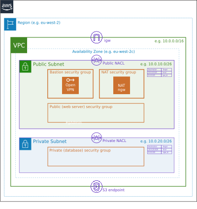

Role Name
=========

semuadmin.aws-network

Ansible role to deploy a standardised Public / Private network topology into an AWS VPC
in accordance with the [AWS Scenario 2 wiki](https://docs.aws.amazon.com/vpc/latest/userguide/VPC_Scenario2.html)
and [AWS Scenario 2 recommended NACL rules](https://docs.aws.amazon.com/vpc/latest/userguide/vpc-recommended-nacl-rules.html#nacl-rules-scenario-2).



Principally intended for sandpit or prototype environments, though it could equally be used
as a small production environment.

The role creates the following AWS elements, the default settings for which fall within
AWS's first year free tier entitlement:
1. public and private subnets with specified CIDRs.
1. internet gateway (IGW, if one does not already exist).
1. public, private, bastion and nat security groups (SG).
1. (optional) public and private network access control lists (NACL) with parameterised rulesets.
1. public and private routing tables (RTE).
1. (optional) S3 VPC endpoint (VPCE) accessible from public and private subnets.
1. Single NAT Gateway (NGW) EC2 instance (Centos/7 AMI by default) , to allow outbound
internet access to instances in the private subnet.
1. Single Linux Bastion EC2 instance (Centos/7 AMI by default), into which the
[semuadmin OpenVPN](https://galaxy.ansible.com/semuadmin/openvpn) ansible role can be
deployed, allowing administrators to directly access instances in both public
and private subnets via their private network interfaces.
1. (optional) elastic IP address (EIP) allocated to bastion instance

By default, the security group and NACL settings will allow inbound HTTP, HTTPS and
OpenVPN (1194/udp) traffic into the public subnet from any source IP, and inbound SSH
traffic from a nominated admin cidr range.

Requirements
------------

1. Internet connectivity to the required AWS VPC.
1. Run against localhost.
1. AWS CLI and required python modules (boto, boto3 etc.) must be installed and configured
on the localhost. 
1. By default, AWS CLI config and credentials (ACCESS_KEY and SECRET_KEY) are stored
in ~/.aws/config and ~/.aws/credentials. Alternatively, AWS CLI credentials may be
specified as environment variables.

Role Variables
--------------

- `provision_network`: true
- `remove_network`: false
- `create_s3_vpce`: true

- `admin_cidr`: "55.66.77.88/32" (administrator's public IP address)
- `vpc_id`: "vpc-123456789"
- `public_cidr`: "172.55.60.0/26"
- `private_cidr`: "172.55.70.0/26"

- `private_key_path`: "~/.ssh/id_rsa"
- `keypair_name`: "id_rsa"
- `region`: "eu-west-2" # eu-west-2 is London
- `availability_zone`: "eu-west-2c"
- `tag_project`: "yourprojectcode"
- `tag_cost_code`: "yourcostcode"

- `standard_ami`: "ami-0eab3a90fc693af19" # Centos/7 AMI
- `standard_instance_type`: "t2.micro"
- `standard_username`: "centos"
- `nat_ami`: "ami-e6768381" # Amazon NAT AMI
- `nat_instance_type`: "t2.micro"
- `nat_username`: "ec2-user"
- `bastion_ami`: "ami-0eab3a90fc693af19" # Centos/7 AMI
- `bastion_instance_type`: "t2.micro"
- `bastion_username`: "centos"
- `db_port`: 5432
- `create_bastion_eip`: false # public IP for bastion instance

- `setup_public_nacl`: true
- `public_nacl_in`:
- `  - [100, 'tcp', 'allow', '0.0.0.0/0', null, null, 80, 80]`
- `  - [110, 'tcp', 'allow', '0.0.0.0/0', null, null, 443, 443]`
- `  - [120, 'udp', 'allow', '0.0.0.0/0', null, null, 1194, 1194]`
- `  - [130, 'tcp', 'allow', "{{ admin_cidr }}", null, null, 22, 22]`
- `  - [140, 'tcp', 'allow', '0.0.0.0/0', null, null, 1024, 65535]`
- `public_nacl_out`:
- `  - [100, 'all', 'allow', '0.0.0.0/0', null, null, null, null]`
- `  - [110, 'tcp', 'allow', "{{ private_cidr }}", null, null, 22, 22]`
- `  - [120, 'tcp', 'allow', '0.0.0.0/0', null, null, "{{ db_port }}", "{{ db_port }}"]`

- `setup_private_nacl`: true
- `private_nacl_in`:
- `  - [100, 'tcp', 'allow', "{{ public_cidr }}", null, null, "{{ db_port }}", "{{ db_port }}"]`
- `  - [110, 'tcp', 'allow', "{{ public_cidr }}", null, null, 22, 22]`
- `  - [120, 'tcp', 'allow', '0.0.0.0/0', null, null, 1024, 65535]`
- `private_nacl_out`:
- `  - [100, 'tcp', 'allow', '0.0.0.0/0', null, null, 80, 80]`
- `  - [110, 'tcp', 'allow', '0.0.0.0/0', null, null, 443, 443]`
- `  - [120, 'tcp', 'allow', "{{ public_cidr }}", null, null, 32768, 65535]`

Dependencies
------------

- AWS CLI installed and configured on localhost.
- Following modules installed on host executing role:
	- python>=2.6
	- boto
	- boto3
	- botocore
 

Example Playbook
----------------

To create public and private networks and provision NAT gateway and Bastion instances
in a specified VPC, region and availability zone with default settings and NACLs:

```yaml

    - name: Provision AWS Public / Private subnet with NAT & Bastion
      hosts: localhost
      gather_facts: false
      
      vars:
        admin_cidr: "55.66.77.88/32"
        vpc_id: "vpc-123456789"
        public_cidr: "172.55.60.0/26"
        private_cidr: "172.55.70.0/26"
        region: "eu-west-2"
        availability_zone: "eu-west-2c"
        tag_project: "yourprojectcode"
        tag_cost_code: "yourcostcode"
        create_bastion_eip: true

      roles:
      - semuadmin.aws-network
```

To create public and private networks and provision NAT gateway and Bastion instances and
customised public and private NACL rules:

```yaml

    - name: Provision AWS Public / Private subnet with NAT & Bastion
      hosts: localhost
      gather_facts: false
      
      vars:
        provision_network: true

        admin_cidr: "55.66.77.88/32"
        vpc_id: "vpc-123456789"
        public_cidr: "172.55.60.0/26"
        private_cidr: "172.55.70.0/26"

        region: "eu-west-2" # eu-west-2 is London
        availability_zone: "eu-west-2c"
        tag_project: "yourprojectcode"
        tag_cost_code: "yourcostcode"
        db_port: 5432
        create_bastion_eip: true

        setup_public_nacl: true
        public_nacl_in:
        - [100, 'tcp', 'allow', '0.0.0.0/0', null, null, 80, 80]
        - [110, 'tcp', 'allow', '0.0.0.0/0', null, null, 443, 443]
        - [112, 'tcp', 'allow', '0.0.0.0/0', null, null, 8080, 8080]
        - [114, 'tcp', 'allow', '0.0.0.0/0', null, null, 8443, 8443]
        - [120, 'udp', 'allow', "{{ admin_cidr }}", null, null, 1194, 1194]
        - [130, 'tcp', 'allow', "{{ admin_cidr }}", null, null, 22, 22]
        - [140, 'tcp', 'allow', '0.0.0.0/0', null, null, 1024, 65535]
        public_nacl_out:
        - [100, 'all', 'allow', '0.0.0.0/0', null, null, null, null]
        - [110, 'tcp', 'allow', "{{ private_cidr }}", null, null, 22, 22]
        - [120, 'tcp', 'allow', "{{ private_cidr }}", null, null, "{{ db_port }}", "{{ db_port }}"]

        setup_private_nacl: true
        private_nacl_in:
        - [100, 'tcp', 'allow', "{{ public_cidr }}", null, null, "{{ db_port }}", "{{ db_port }}"]
        - [110, 'tcp', 'allow', "{{ public_cidr }}", null, null, 22, 22]
        - [120, 'tcp', 'allow', '0.0.0.0/0', null, null, 1024, 65535]
        private_nacl_out:
        - [100, 'tcp', 'allow', '0.0.0.0/0', null, null, 80, 80]
        - [110, 'tcp', 'allow', '0.0.0.0/0', null, null, 443, 443]
        - [120, 'tcp', 'allow', "{{ public_cidr }}", null, null, 32768, 65535]

      roles:
      - semuadmin.aws-network
```

To remove the network:

```yaml

    - name: Provision AWS Public / Private subnet with NAT & Bastion
      hosts: localhost
      gather_facts: false
      
      vars:
        provision_network: false
        remove_network: true

        admin_cidr: "55.66.77.88/32"
        vpc_id: "vpc-123456789"
        public_cidr: "172.55.60.0/26"
        private_cidr: "172.55.70.0/26"

        region: "eu-west-2" # eu-west-2 is London
        availability_zone: "eu-west-2c"
        tag_project: "yourprojectcode"
        tag_cost_code: "yourcostcode"
        
      roles:
      - semuadmin.aws-network
```
License
-------

BSD

Author Information
------------------

semuadmin@noreply.user.github.com
